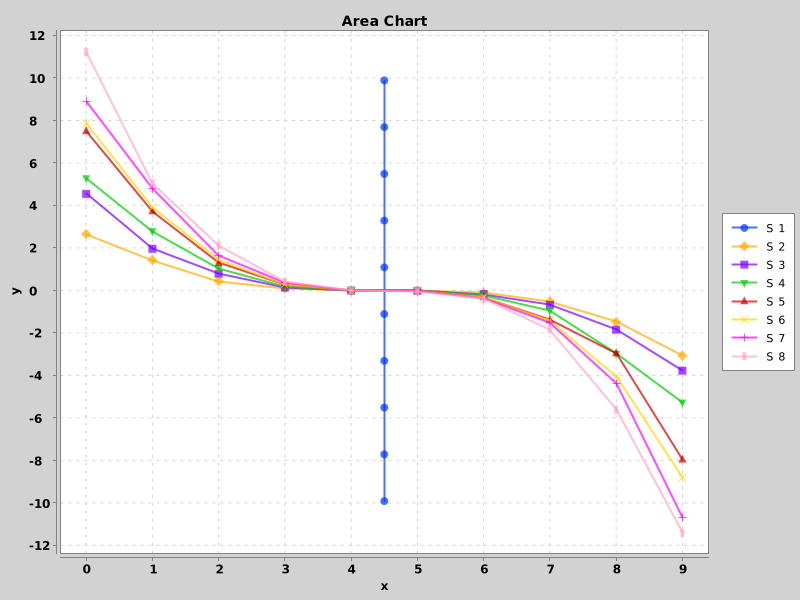

# java-charts-webui

Web user interface for creating charts and diagrams.

## Usage

You can run `java -jar java-charts-webui.jar` to start the server. The server will be bound to `127.0.0.1:80`, so you should be able to open http://localhost/ in your browser. Stop the server using `Ctrl`+`C`.

I had some problems with Windows 11, but I can't figure out what caused them. So if in doubt, use a Linux system. Also make sure that only you can access the web server.

Its use is largely self-explanatory: adjust the code for generating the functions and click on Send Code; the result will then be visible below.

## Demo

Showcase of the web interface:


Example of what is technically possible:

```java
import org.knowm.xchart.BitmapEncoder;
import org.knowm.xchart.XYChart;
import org.knowm.xchart.XYChartBuilder;

public class MySupplierImpl implements MySupplier {
  public int numberOfSeries() {
    return 8;
  }

  public String getTitle(int seriesIndex) {
    return "S " + (seriesIndex + 1);
  }

  public double[][] generateSeries(int seriesIndex) {
    if (seriesIndex == 0) {
      double[][] series = new double[10][2];
      for (int i = 0; i < series.length; i++) {
        series[i][0] = 4.5;
        series[i][1] = 22.0/series.length*(i+0.5)-11.0;
      }
      return series;
    }
    
    double[][] series = new double[10][2];
    double a = seriesIndex + 1;
    for (int i = 0; i < series.length; i++) {
      double x = (i - series.length / 2.0 + 0.5) * 0.25;
      double y = -f(x, a);
      series[i][0] = i;
      series[i][1] = y;
    }
    return series;
  }

  private double f(double x, double a) {
    return x * x * x * a * (Math.random()*0.25+0.875);
  }

  // Do not change this method, unless you know what you are doing.
  // It is used to plot the series generated by the methods above.
  public String plot() {
    XYChart chart =
        new XYChartBuilder()
            .width(800)
            .height(600)
            .title("Area Chart")
            .xAxisTitle("x")
            .yAxisTitle("y")
            .build();
    for (int i = 0; i < numberOfSeries(); i++) {
      double[][] series = generateSeries(i);
      double[] xData = new double[series.length];
      double[] yData = new double[series.length];
      for (int j = 0; j < series.length; j++) {
        xData[j] = series[j][0];
        yData[j] = series[j][1];
      }
      chart.addSeries(getTitle(i), xData, yData);
    }
    return MyPlotter.imgToBase64String(BitmapEncoder.getBufferedImage(chart));
  }
}
```



<sub>By the way: I haven't yet figured out how to influence the scaling of the y-axis, but theoretically this should also be possible.</sub>

## Contributing

Send me any suggestions via an issue or pull request if you want to improve something. I will try to respond as soon as possible.
